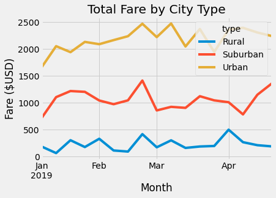

# Module 5 Challenge – PyBer Analysis
## Overview of PyBer Analysis
**#Purpose**

    The purpose of the PyBer analysis is to provide an overview of the ride-sharing data by city 
    type (Rural, Urban, Suburban) and showcase the total weekly fares for each city type using a 
    multiple-line graph.
    
# Results
The summary reveals that there is a much larger demand for PyBer in urban cities when compared to 

rural and suburban cities. The total number of rides and total number of drivers is significantly larger

in urban cities but has a lower Average Fare per Ride and per Driver when compared to rural and 

suburban cities. It can be inferred that due to the low demand of PyBer in Rural and Suburban cities the higher 

the Average Fare per Driver. The chart below further highlights the comparison between city types. 

The multiple-line-chart "Total Fare by City Type" provides trends of total fares in rural, suburban, and 

urban cities  from January 01, 2019, and April 29, 2019. The green line demonstrates how fares in urban 

cities totaled around $1,600 to $2,300 in a 4-month period. Furthermore, the orange line shows how 

fares in suburban cities totaled around $700 to $1,300 in the same 4-month period. Lastly, the blue line 

represents how fares in rural cities totaled around $300 from  beginning to end during the same period. 

# Summary

Based on the analysis findings I recommend lowering the cost of using PyBer in Rural areas as this

might discourage potential cliental from using PyBer due to the high average fare per ride. Secondly, 

I would encourage your marketing team to advertise more and encourage others to apply for driver 

positions in rural and suburban areas in efforts to increase the number of drivers in rural and suburban 

cities. Which in turn would lower the average fare per ride. Lastly, I would consider a further analysis 

to figure out other factors that contribute to the high ride costs in rural areas. 

